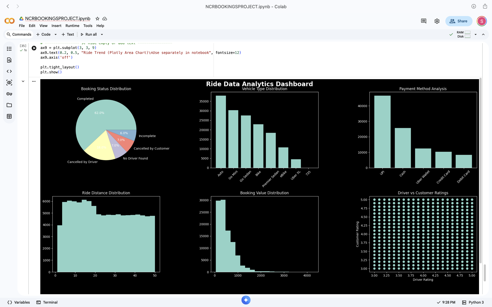
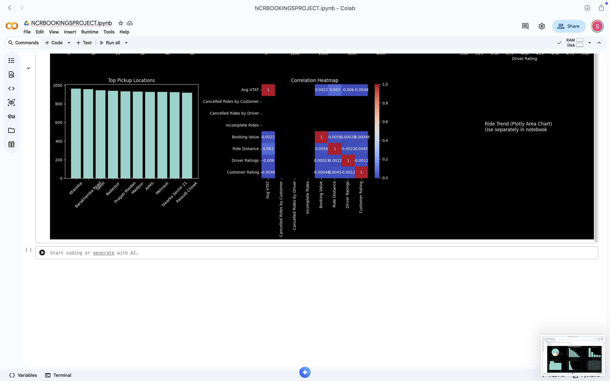
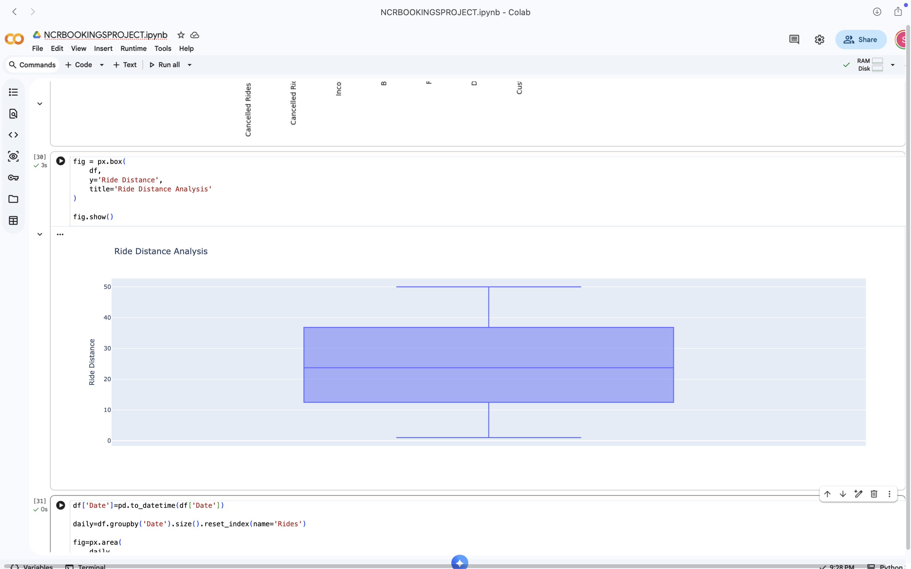

# 🚖 NCR Ride Bookings Analysis Project

## 📌 Project Overview
This project analyzes NCR ride booking data to understand booking patterns, customer behavior, vehicle usage, payment methods, and ride performance.

The analysis is performed using Python in a Jupyter Notebook, and insights are visualized using charts and graphs.

---

## 📁 Repository Structure

NCR-Bookings-Project/

├── NCRBOOKINGSPROJECT.ipynb     # Main Jupyter Notebook (EDA & Analysis)  
├── ncr_ride_bookings.csv        # Dataset used for analysis  
├── output.png                   # Visualization / dashboard output 1  
├── output1.png                  # Visualization output 2  
├── output2.png                  # Visualization output 3  
└── README.md                    # Project documentation  

---

## 🎯 Objectives
- Analyze NCR ride booking patterns  
- Study booking status distribution  
- Identify most used vehicle types  
- Understand payment method trends  
- Analyze ride distance and booking value  
- Compare driver and customer ratings  
- Generate meaningful business insights  

---

## 🛠️ Tools & Technologies
- Python  
- Pandas  
- NumPy  
- Matplotlib  
- Seaborn  
- Plotly  
- Jupyter Notebook  

---

## 📊 Key Visualizations
- 📌 Booking Status Distribution (Pie Chart)  
- 🚗 Vehicle Type Distribution (Bar Chart)  
- 💳 Payment Method Analysis (Bar Chart)  
- 📏 Ride Distance Distribution (Histogram)  
- 💰 Booking Value Distribution (Histogram)  
- ⭐ Driver vs Customer Ratings (Scatter Plot)  
- 📍 Pickup Location Analysis  
- 🔗 Correlation Heatmap  
- 📈 Daily Ride Trends  

---

## 📸 Outputs

### Dashboard Overview


### Visualization 1


### Visualization 2


---

## 🚀 How to Run This Project (All Steps)

```bash

git clone https://github.com/GopuSankeerthana/NCR-BOOKINGS-ANALYSIS-PROJECT.git

cd NCR-BOOKINGS-ANALYSIS-PROJECT

pip install pandas numpy matplotlib seaborn plotly

jupyter notebook NCRBOOKINGSPROJECT.ipynb
